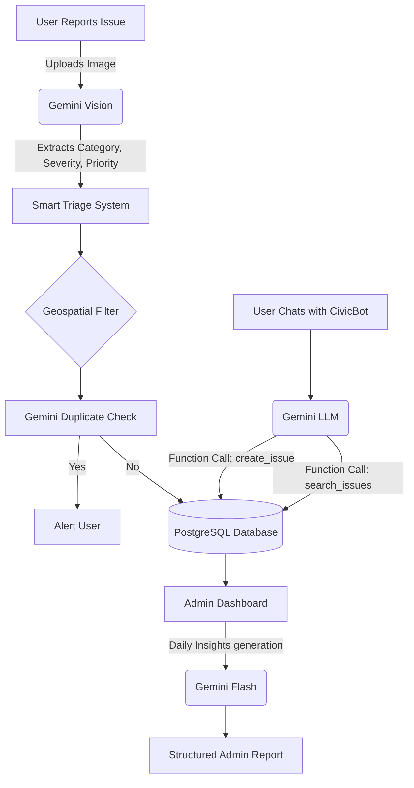

# CommunityHero - AI-Powered Civic Issue Reporting

CommunityHero is a next-generation civic issue reporting platform built for the **Vibe2Ship Hackathon**. It empowers citizens to report local issues (like potholes, broken streetlights, or garbage dumps) and leverages Google's Gemini AI to automate the entire triage workflow.

## 🚀 Key Features

- **Gemini Vision Auto-Triage**: Upload a photo of an issue, and Gemini 2.5 Flash will automatically analyze the image, detect the category (e.g., pothole), estimate severity, suggest a description, and assign priority and department.
- **CivicBot Agent**: A fully agentic AI assistant powered by Gemini. You can chat with CivicBot to search for nearby issues or just say, "There's a broken streetlight near the park," and the AI will invoke a tool to automatically file the report on your behalf.
- **AI Duplicate Detection**: Before a report is submitted, Gemini analyzes nearby unresolved issues to warn users if the issue has already been reported, reducing duplicate work for city admins.
- **Smart Admin Insights**: An AI-generated daily digest for city officials summarizing daily reports, common issues, area trends, suggested priorities, and resource allocation recommendations.
- **Gamified Community**: Citizens earn points for reporting issues and verifying other people's reports, fostering a collaborative community effort.

## 🧠 Agentic AI Architecture & Workflow

CommunityHero goes beyond simple chatbots by implementing a true **Agentic Workflow** using Google Gen AI SDK:

1.  **Vision Workflow**: When a photo is uploaded, Gemini analyzes the image, identifies the problem, and performs a multi-step reasoning process to triage the issue and output strict Structured JSON.
2.  **Function Calling Workflow**: CivicBot is equipped with `search_issues`, `create_issue`, `check_status`, and `update_issue` tools. The agent utilizes a recursive `while` loop (up to 5 iterations) to perform **multi-step reasoning**. It autonomously decides which tools to call, observes the results, and can chain calls before delivering a final response to the user.
3.  **Spatial Duplicate Detection**: The frontend calculates geographic distance (Haversine formula) to filter the 10 closest nearby issues. It then passes this optimized dataset to the Gemini API to reason whether the new report is a duplicate, saving database and memory overhead.

## 🔒 Security & Engineering Best Practices

To ensure production-readiness, CommunityHero implements multiple security layers:

- **Prompt Injection Protection**: All user-provided text in Gemini prompts is strictly wrapped in `<user_input>` XML tags. The system prompt explicitly instructs the LLM to treat this block as passive data, mitigating jailbreak attempts and instructions overrides.
- **Input Validation**: All backend API endpoints (`/ai/chat`, `/ai/categorize`, `/ai/check-duplicate`) use **Zod** schema validation to reject malformed or invalid payloads before they reach the LLM or Database.
- **Rate Limiting**: AI endpoints are protected with `express-rate-limit` to prevent spam, API quota abuse, and unexpected billing spikes.
- **Role-Based Authorization**: Tools like `update_issue` perform server-side checks against the database to verify the user holds an `admin` role, guaranteeing secure backend function execution.
- **Error Handling & Fallbacks**: The application gracefully handles Gemini API timeouts, missing keys, and parsing failures by providing safe fallback UI states and caching responses.

## 🛠️ Technologies Used

- **Google AI Studio / Gemini API**: Core AI engine powering Vision, Function Calling, text generation, and reasoning.
- **React (Vite) + Tailwind CSS + shadcn/ui**: Modern, responsive, and beautiful frontend.
- **Node.js + Express**: Robust backend API server.
- **PostgreSQL + Drizzle ORM**: Relational database for structured issue tracking.
- **Leaflet**: Interactive maps for precise location tagging.

## 📦 Project Structure

- `community-hero/`: The React frontend application.
- `api-server/`: The Node.js Express backend.
- `db/`: Database schema and configuration.

## 🚀 Setup & Deployment

1.  Clone the repository.
2.  Install dependencies: `npm install`
3.  Set your environment variables in `.env`:
    - `GEMINI_API_KEY`: Your Google Gemini API key.
    - `DATABASE_URL`: Your PostgreSQL connection string.
4.  Run the development server: `npm run dev`
5.  Access the app at `http://localhost:3000`

## 🔮 Future Scope

1. **IoT Integration**: Auto-reporting from smart trash cans and light sensors.
2. **Predictive Analytics**: Using historical data to predict infrastructure failures before they happen.
3. **Multilingual Voice Reports**: Using Gemini's audio processing to allow users to call a hotline and speak to CivicBot in any language.
4. **Google Maps Platform Integration**: Optimizing routes for city workers based on the day's critical AI triaged reports.

## 🏆 Vibe2Ship Submission

This project was built to demonstrate the power of Google AI Studio and Gemini in solving real-world civic problems through Agentic AI.
